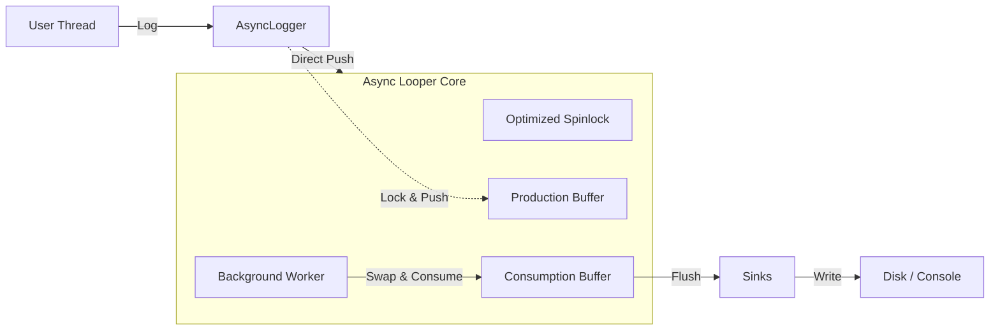
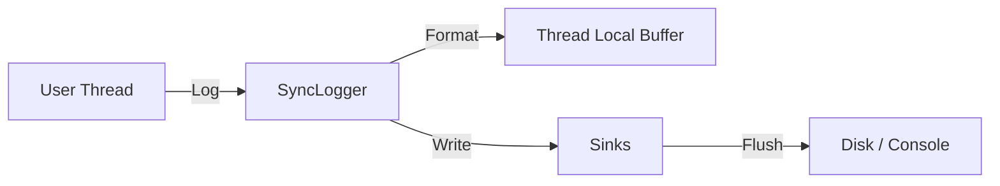
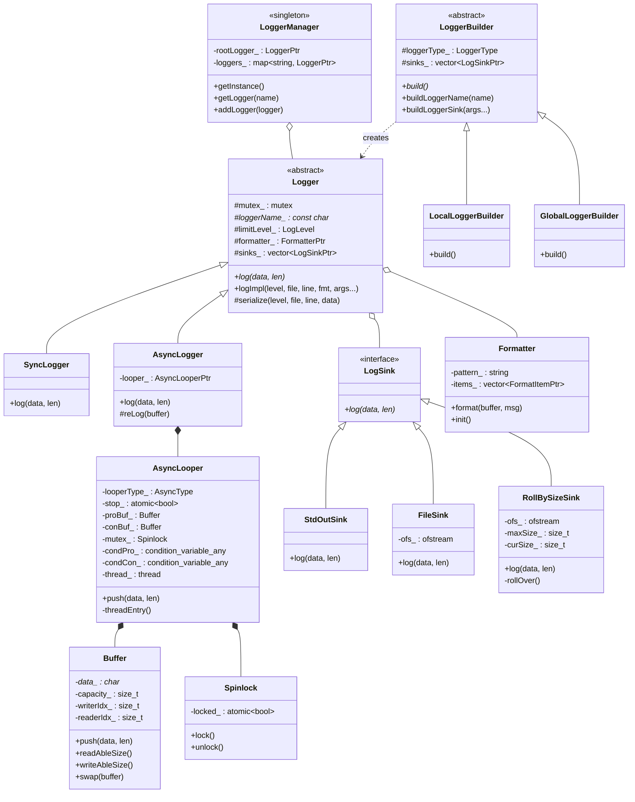
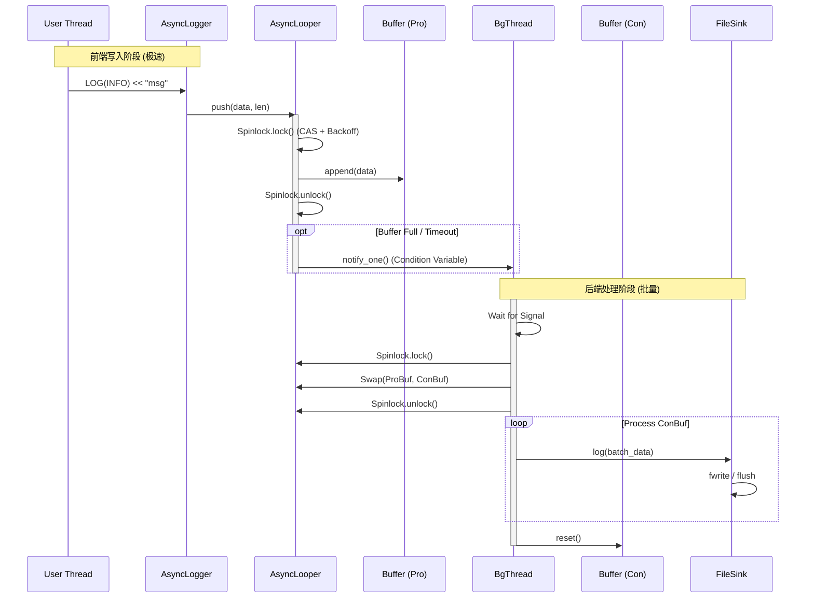
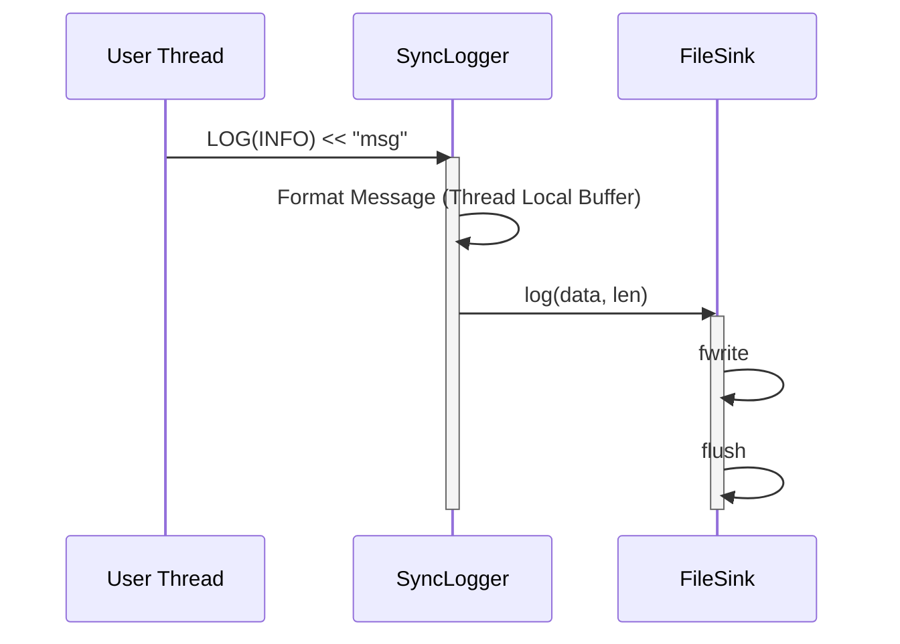

# Zlog - High Performance C++ Logging Library

Zlog 是一个专为高并发场景设计的高性能 C++ 日志库。它采用了无锁设计思想（自旋锁优化）、双缓冲机制以及零拷贝技术，在多线程环境下展现出远超传统日志库（如 Spdlog, Glog）的吞吐量和低延迟表现。

## 核心特性

- **极致性能**: 在 16 线程高并发场景下，异步日志延迟低至 200ns 级别。
- **双缓冲机制**: 生产缓冲区与消费缓冲区分离，通过指针交换实现无锁（或低锁）数据传递。
- **自旋锁优化**: 采用 Read-Phase + Backoff 策略的自旋锁，大幅减少上下文切换开销。
- **零拷贝**: 核心链路使用指针传递，避免不必要的内存拷贝。
- **严格时序**: 移除线程局部缓存，保证多线程日志的严格写入顺序。

## 系统架构 (Architecture)

### 1. 异步架构 (Async Mode)

Zlog 采用经典的异步生产-消费模型。前端（业务线程）负责极速写入内存缓冲区，后端（后台线程）负责批量落盘。



### 2. 同步架构 (Sync Mode)

同步模式下，用户线程直接完成格式化与落盘操作，适合调试或低频关键日志。



## 核心类图 (Class Diagram)



## 核心流程时序图 (Sequence Diagram)

### 1. 异步写入流程 (Async Flow)

以下展示了异步日志从用户调用到最终落盘的完整流程：



### 2. 同步写入流程 (Sync Flow)

同步模式下，调用链直接且简单，保证数据即时落盘。



## 性能表现

在 16 线程并发写入 8 字节小包的极端场景下：
- **Zlog Async**: ~203 ns
- **Spdlog Async**: ~12,294 ns
- **Glog**: ~11,442 ns

Zlog 实现了 **60倍** 于竞品的性能提升。

## 编译与运行

```bash
mkdir build && cd build
cmake -DCMAKE_BUILD_TYPE=Release ..
make -j
./tests/zlog_benchmark
```
