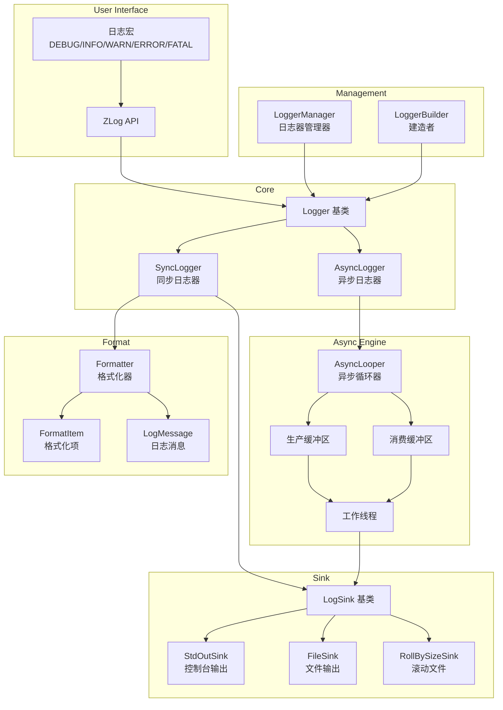
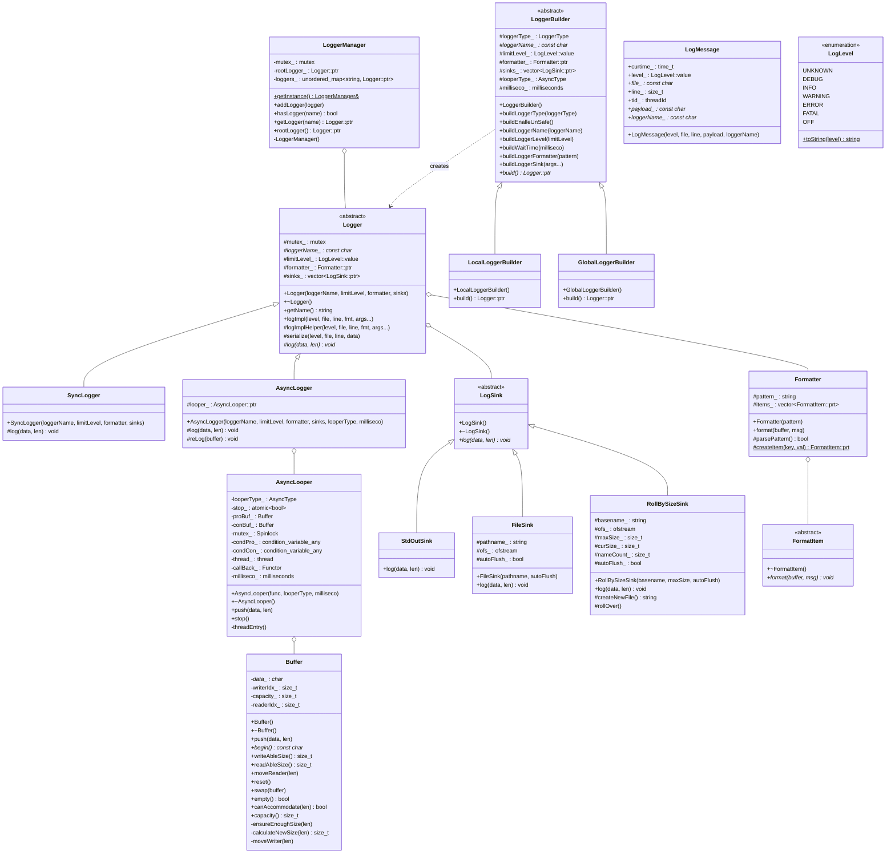
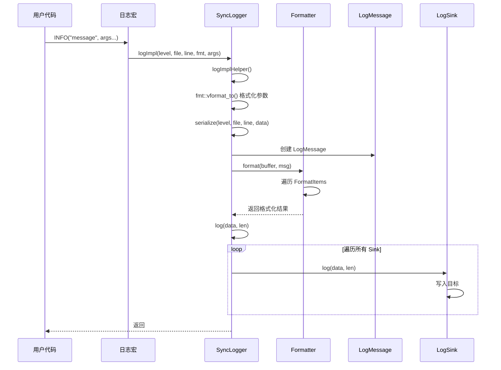
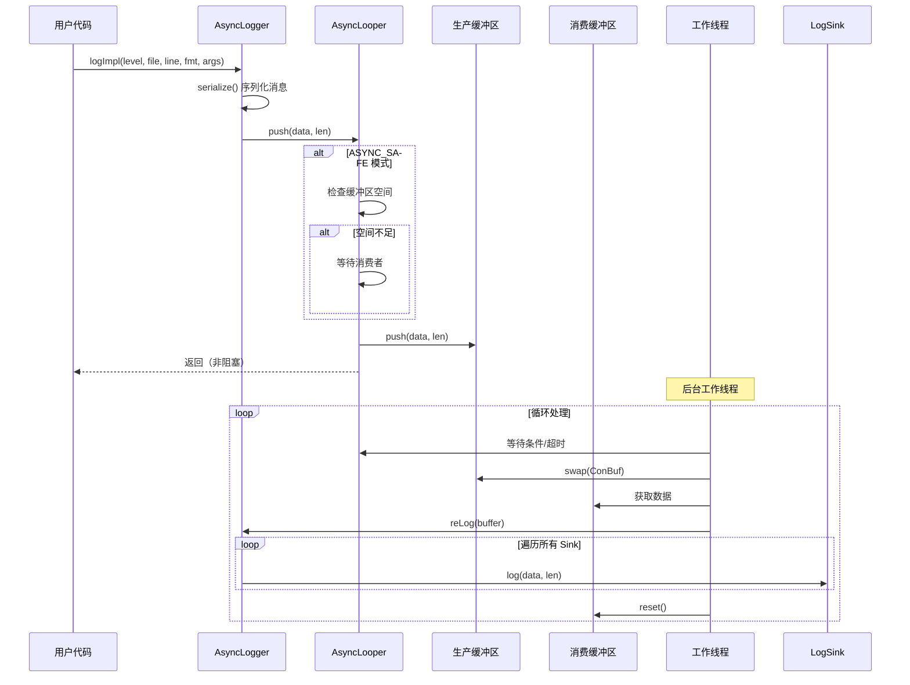

# ZLog

ZLog 是一个高性能、轻量级的 C++ 日志库，支持同步和异步两种日志模式。采用双缓冲区技术和生产者-消费者模式实现高效的异步日志，适用于对性能有较高要求的应用场景。

## 特性

- 同步/异步双模式支持
- 双缓冲区异步实现，减少锁竞争
- 多种日志落地方式（控制台、文件、滚动文件）
- 灵活的日志格式化
- 线程安全
- 建造者模式简化配置

## 编译依赖

| 依赖项 | 版本要求 | 说明 |
|--------|----------|------|
| CMake | >= 3.18 | 构建系统 |
| C++ 编译器 | C++11 | GCC 5+ / Clang 3.4+ |
| fmt | 任意版本 | 格式化库 |

### 编译方法

```bash
mkdir build && cd build
cmake ..
make -j$(nproc)
```

## 系统架构



## 核心类图



## 时序图

### 同步日志时序图



### 异步日志时序图



## 性能对比

基准测试环境说明：
- 测试环境：WSL2 Ubuntu24.04 12th Gen Intel(R) Core(TM) i5-12500H 8G Release
- 测试框架：Google Benchmark
- 消息大小：8B / 512B / 4096B
- 线程数：1 / 2 / 4 / 8 / 16
- 吞吐量计算：消息大小 / 操作时间

### 8 字节消息吞吐量对比 (MB/s)

| 线程数 | ZLog Sync | ZLog Async | ZLog Async Unsafe | Spdlog Sync | Spdlog Async | Glog |
|--------|-----------|------------|-------------------|-------------|--------------|------|
| 1 | 12.61 | 64.66 | 58.21 | 61.04 | 22.62 | 4.06 |
| 2 | 22.97 | 58.67 | 54.89 | 116.27 | 1.22 | 2.96 |
| 4 | 42.40 | 47.10 | 37.77 | 247.65 | 0.68 | 2.18 |
| 8 | 64.66 | 26.97 | 35.14 | 384.62 | 0.84 | 1.08 |
| 16 | 82.93 | 36.33 | 26.67 | 600.63 | 0.75 | 0.86 |

### 512 字节消息吞吐量对比 (MB/s)

| 线程数 | ZLog Sync | ZLog Async | ZLog Async Unsafe | Spdlog Sync | Spdlog Async | Glog |
|--------|-----------|------------|-------------------|-------------|--------------|------|
| 1 | 540.89 | 669.27 | 1387.49 | 1207.92 | 476.66 | 203.87 |
| 2 | 1087.76 | 872.05 | 1043.60 | 2478.57 | 27.43 | 135.82 |
| 4 | 2142.06 | 828.47 | 2357.31 | 4479.49 | 34.99 | 123.30 |
| 8 | 3110.35 | 830.17 | 1755.73 | 6748.57 | 44.07 | 67.22 |
| 16 | 4173.72 | 655.29 | 1018.84 | 9530.03 | 46.97 | 55.20 |

### 4096 字节消息吞吐量对比 (MB/s)

| 线程数 | ZLog Sync | ZLog Async | ZLog Async Unsafe | Spdlog Sync | Spdlog Async | Glog |
|--------|-----------|------------|-------------------|-------------|--------------|------|
| 1 | 1330.31 | 1003.52 | 901.38 | 1482.66 | 701.64 | 846.81 |
| 2 | 2540.18 | 951.72 | 835.53 | 2591.06 | 192.56 | 377.71 |
| 4 | 4699.89 | 942.97 | 1375.24 | 5177.59 | 212.81 | 366.13 |
| 8 | 6974.86 | 986.29 | 1136.44 | 10977.53 | 279.37 | 360.34 |
| 16 | 11489.01 | 865.80 | 1715.22 | 13377.19 | 305.73 | 326.49 |

### 性能分析

1. **同步模式**：ZLog 同步模式在多线程场景下表现出良好的扩展性，随线程数增加吞吐量显著提升。

2. **异步模式**：ZLog 异步模式在单线程/低竞争场景下延迟最低（~118ns），适合对延迟敏感的场景。

3. **对比 Spdlog**：
   - Spdlog 同步模式吞吐量更高
   - 但 Spdlog 异步模式在多线程下性能下降严重
   - ZLog 异步模式在多线程下保持稳定的低延迟

4. **对比 Glog**：ZLog 在所有场景下均显著优于 Glog。

## 快速开始

```cpp
#include "zlog.h"

int main() {
    // 使用默认 root 日志器
    INFO("Hello, {}!", "ZLog");
    
    // 创建自定义异步日志器
    zlog::GlobalLoggerBuilder builder;
    builder.buildLoggerName("async_logger");
    builder.buildLoggerType(zlog::LoggerType::LOGGER_ASYNC);
    builder.buildLoggerLevel(zlog::LogLevel::value::DEBUG);
    builder.buildLoggerFormatter("[%d{%H:%M:%S}][%p]%T%m%n");
    builder.buildLoggerSink<zlog::FileSink>("./logs/app.log");
    builder.build();
    
    auto logger = zlog::getLogger("async_logger");
    logger->ZLOG_INFO("Async logging: {}", 42);
    
    return 0;
}
```

## 格式化字符串

| 占位符 | 说明 |
|--------|------|
| `%d{format}` | 时间，format 为 strftime 格式 |
| `%t` | 线程 ID |
| `%c` | 日志器名称 |
| `%f` | 源文件名 |
| `%l` | 行号 |
| `%p` | 日志级别 |
| `%T` | 制表符 |
| `%m` | 日志消息 |
| `%n` | 换行符 |

## License

MIT License
